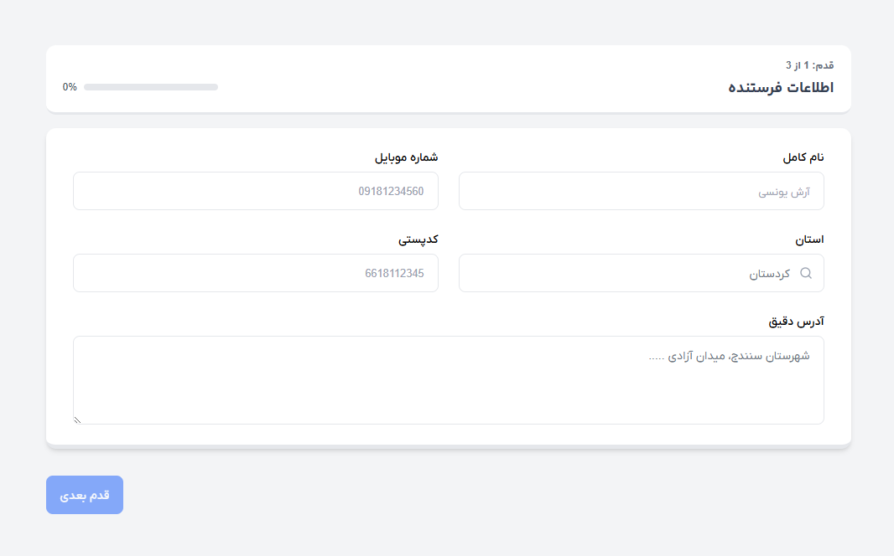
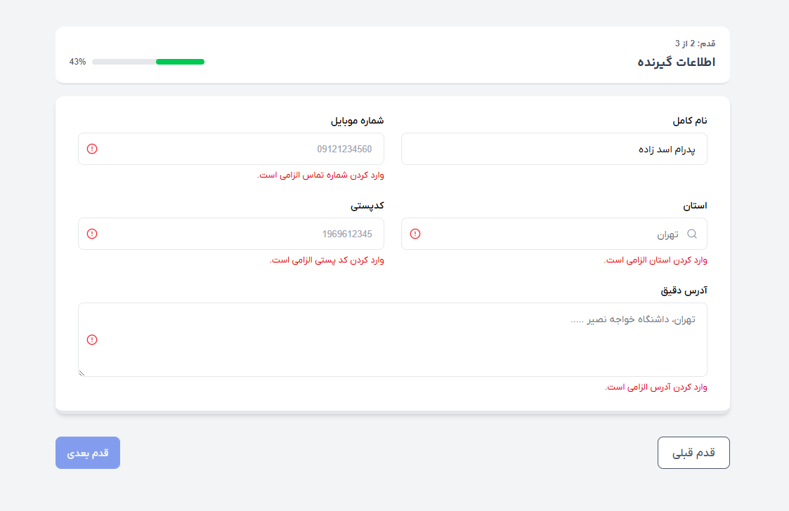
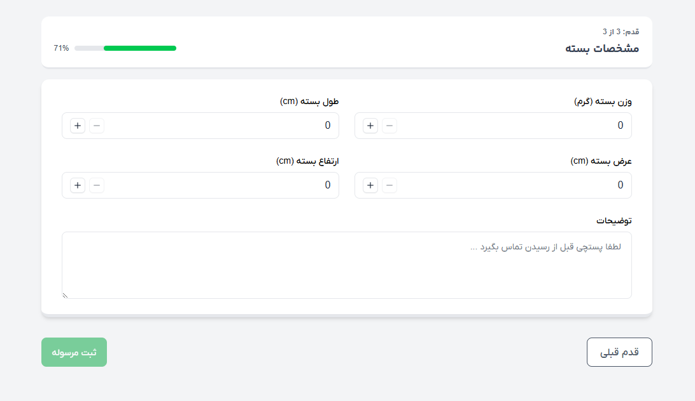

# 📦 Shipment Form with Vue 3 + Preline

This project is a **multi-step shipment form** built with **Vue 3 Composition API**, **TailwindCSS v4**, and **Preline UI**.  
Each step is validated with **Vuelidate**, and once the form is submitted, a success message with a green checkmark is displayed.

---

## 🖼️️ Screenshots





---

## 🚀 Features
- Multi-step form with clean UX
- Validation powered by **Vuelidate**
- Responsive design using **TailwindCSS v4**
- UI components styled with **Preline**
- Glassmorphism loading spinner overlay
- Success message with animated green checkmark
- Modular and reusable Vue components

---

## 🛠️ Tech Stack
- [Vue 3](https://vuejs.org/) (Composition API)
- [TailwindCSS v4](https://tailwindcss.com/)
- [Preline UI](https://preline.co/)
- [Vuelidate](https://vuelidate-next.netlify.app/)

---

## ⚙️ Installation & Setup

```bash
# Clone the repository
git clone https://github.com/ArashYounesi/vue-shipment-form.git

cd vue-shipment-form

# Install dependencies
npm install

# Run the project
npm run dev
